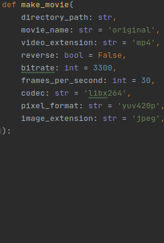
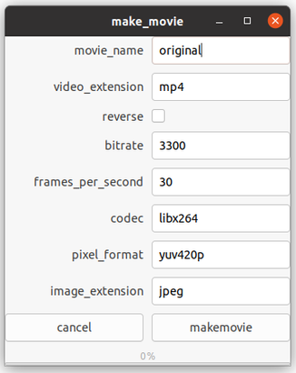
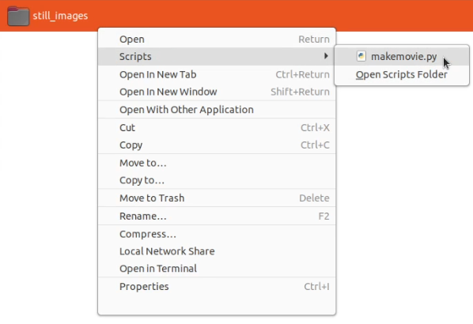

Make any Python method available in the Nautilus menu, and prompt a window for the user inputs
==============================================================================================

If you have useful Python methods in your Projects, you can make them available in the 
Nautilus file manager / GNOME Files by adding one file and writing 3 lines of code: 
- One line to define the path where your code lives.
- A second optional line to the virtual environment with additional packages, in the case they are needed.
- The third line to import the specific method. So a window can be generated to prompt the input variables, and execute the method.

If you want to build a Nautilus menu method from scratch, you might consider other strategies than fiddling with sys.path.
This is made to quickly convert existing Python functionality to a Nautilus menu option. 
In the images below you can see how the parameters from a Python method are shown in a window that is accessible from Nautilus. 





Since this works with a linked path, you don't have to re-build an application or restart Nautilus. 
Any code change in your Project will be directly available when you right click on a file and launch the script again. This is useful while developing.

The Nautilus approach is also very practical since you can apply an action to any single file or any file in a directory by just selecting it.
When selecting some files (not all) in a directory, this is definitely more practical than providing several specific paths in a command line tool.


Method requirements
===================
The Python method should have exactly one of the following parameters: 
['file_path', 'file_paths', 'directory_path', 'directory_paths']
Since this is going to work after selecting one or more files (or directories) in Nautilus, it makes sense to have
a parameter that describes exactly that.

The parameters should be annotated with the type. As a second guess, the type of the default value will be used.

If the method depends on external libraries, a virtual environment should have been set up.
The code in the Nautilus scripts folder, will only point to the place where the code and virtual environment lives.


Requirements and installation
=============================
This works on my system with Ubuntu 20.04, GNOME nautilus 3.36.3 and Python 3.8.

1) Make sure python gtk is installed

```sudo apt-get install libgtk-3-dev```

Optionally you could replace the GTK code by Python's build-in TKinter, and skip installing gtk.

2) Add the file ```python_nautilus_helper.py``` in '.local/share/nautilus/scripts'. This is where Nautilus expects the scripts.

3) 
   * a) Add the ```custom_method_template.py``` in the same directory. Rename it to a name that you would like to see in the file system.
   For example: ```make_movie.py``` (see screenshot above).
   
   * b) In this file, add the path to the root of your Python project to ```sys.path``` (line 5). 
You can let your Python code live in the directory that you set up already, only link to the path.

   * c) Import the specific method (in line 7). This works depending on the path you defined in step 3b.
Use ```as method```, since that is the name the code below expects.
   
   * d) In case you custom Python method only uses Python standard libraries, you can delete or comment line 6. 
   In case you have an environment set up, you have to add the path to those 'site_packages' as well.
   
4) ```custom_method_template.py``` should already be executable, so probably you don't have to do anything. 
   But if it is not, and you renamed it to ```make_movie.py``` you can call

   ```chmod +x make_movie.py```
   

Some strategies and ideas
=========================
If you want to call several methods, you can write a single wrapper method that collects all parameters you need, and then call one or more other methods.

Since it is difficult to write dynamic code that always knows exactly what the user wants to achieve, you could have a look at how file/directory paths are handled.
If you want to be very specific on what kind of path you want your method to work for, you could do those checks in your method, before doing anything else.
You can do checks like ```os.path.isdir(file_path)``` or ```file_path.endswith('.jpeg'')```, and only do something on the file types that you approve.

You can group your methods in subdirectories within the nautilus scripts directory. If you make a directory 'image_operations' and place an executable script in there, it will show up as  scripts > image_operations > make_movie.py in the Nautilus right click menu.

If you are using the Nautilus filesystem already, then it can be useful to replace any program that starts with a file dialog that you often use with this approach: launch it from Nautilus with the files / dirs selected.
Navigating through many subdirectories in such file dialog is a waste of time, when you have the directory already open in Nautilus.

Be aware that many things can be done on the command line, without Python. 
For example, tools like imagemagick and ffmpeg can do all kind of image operations (resizing, prefixing, etc, etc) with one line commands. 
They can be easily attached to nautilus with a simple bash script. So when you don't have the Python code ready, you might want to look for command line tools first (before considering writing anything in Python).

Copying a file will copy the execute permission. So if you have ```make_movie.py``` set up and want to add another functionality, the fastest is to copy that file, so you don't have to call ```chmod``` again.


Improvements
============
python gtk could be replaced by Tkinter, which is in the standard library, and thus makes installing the first requirement obsolete.
For extending functionality, Gtk is a good choice. You could for example change the Nautilus window appearance.

Allow methods that specify file formats. 
For example if a method has a 'jpeg_file_path' or 'jpeg_file_paths' parameter, parse the first part as a file extension.
only consider file_paths with that extension. Something like:
```glob.glob(os.path.join(file_path, '*.{}'.format('jpeg'))```

Another approach could be to attach allowed_extensions to the method. ```method.allowed_extensions = ('jpeg', 'jpg', 'JPEG')```
and then use that as 
```[fp for fp in file_paths if fp.endswith(method.allowed_extensions)]```


python_file_operations
======================
I added a collection of file operations in this repo: 
https://github.com/josvromans/python_file_operations

All of them can be made available in Nautilus with the described method.
As said before, some of these can work easier (and faster) with command line tools. 
However, the Python approach can still be useful if Python is your tool of choice to customize anything you want 
(in the functionality, and the appearance in the input window).
Any methods from this repository can of course also be copied in your project.
The methods include the following:

* File operations
- prefix_filename
- postfix_filename
- split_large_folder (for example in subdirectories of 100 files)
- weed_out_files
- make_filename_unrecognizable (convert filenames to an unreadable hash string)
- number_filenames
- sort_files_by_size

* Image operations
- resize_image
- add_margin
- crop_image_in_equal_parts
- paste_image_in_center
- crop_center
- apply_filter (all PIL ImageFilters)
- image_difference

* vide operations
- make movie (from a directory of image files)
- merge videos (take two or more video files, and past them to one final video file)
